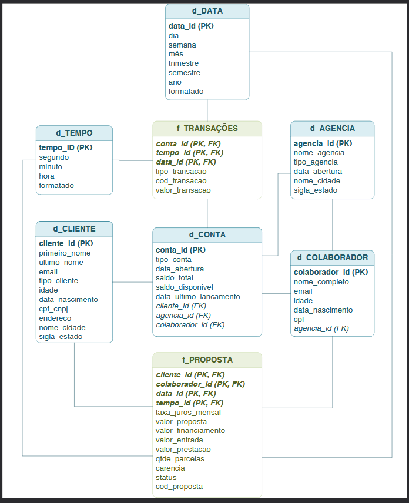

# Bank Data Engineering Pipeline

This project implements a complete ETL (Extract, Transform, Load) pipeline using **Python (Pandas)** and **DuckDB**. It extracts raw banking data from CSV files, transforms the data ensuring quality and integrity, and loads it into a local **DuckDB** database modeled as a Star Schema for downstream analytics.

## 1. Pipeline Overview

The orchestration is managed by the main notebook **`etl.ipynb`**, which executes the following steps sequentially:

1.  **Ingestion (Bronze):** Reads raw CSV files dynamically, sanitizing strings and converting dates to native datetime objects.
2.  **Transformation (Silver):** Cleans data, expands nested JSON structures (e.g., addresses), and repairs referential integrity using inferred members for missing relationships.
3.  **Staging:** Persists the processed data into the DuckDB database as staging tables.
4.  **Modeling (Gold):** Executes SQL scripts to transform staging tables into Dimensions and Facts.

## 2. Data Model

The data were arranged in a multidimensional model (star schema) to support OLAP queries.

<p align="center">
  
</p>

## 3. Analytics Layer

The project enables data analysis directly through SQL or Python. The Star Schema allows for high-performance OLAP queries, including:

* Total transaction volume per agency and state.
* Evolution of credit proposal acceptance rates over time.
* Ranking of top-performing employees by financed volume.
* Analysis of customer profiles and geographical distribution.
* Interactive visualizations generated via Altair (Scatter plots, Multi-series line charts).

## 4. Getting Started

### Prerequisites
* **Python 3.8** or higher.
* **Libraries:** `pandas`, `duckdb`, `altair`, `holidays`.
* **A Google Drive link with a ZIP file containing the CSVs. It is obligatory to put the link in `gdrive_link.txt` file.

### Directory Structure
To ensure the pipeline works correctly, maintain this folder structure:

```text
/project-root
├── etl.ipynb                    # Main Pipeline Notebook
├── src/
│   └── utils.py                 # Helper functions (Download, Config)
├── sql/                         # SQL Scripts for Star Schema
│   ├── 01_d_agencia.sql
│   ├── ...
│   ├── 05_f_transacoes.sql
│   └── 06_f_proposta.sql
├── var/                         # JSON files for function mappings (for transfoormations routines)
|   ├── date_mapping.json
|   ├── function_mapping.json
|   ├── relationship_mapping.json
└── gdrive_link.txt              # An empty file. Necessary to put the Google Drive link with the CSVs.
```
